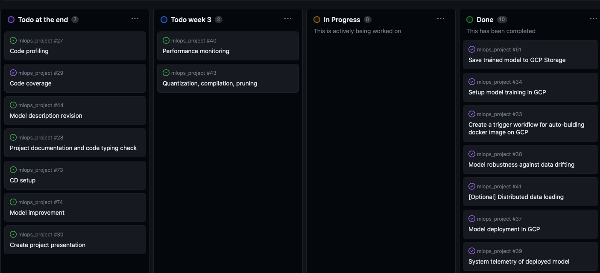

# Exam template for 02476 Machine Learning Operations

This is the report template for the exam. Please only remove the text formatted as with three dashes in front and behind
like:

```--- question 1 fill here ---```

where you instead should add your answers. Any other changes may have unwanted consequences when your report is auto
generated in the end of the course. For questions where you are asked to include images, start by adding the image to
the `figures` subfolder (please only use `.png`, `.jpg` or `.jpeg`) and then add the following code in your answer:

```markdown

```

In addition to this markdown file, we also provide the `report.py` script that provides two utility functions:

Running:

```bash
python report.py html
```

will generate an `.html` page of your report. After deadline for answering this template, we will autoscrape
everything in this `reports` folder and then use this utility to generate an `.html` page that will be your serve
as your final handin.

Running

```bash
python report.py check
```

will check your answers in this template against the constrains listed for each question e.g. is your answer too
short, too long, have you included an image when asked to.

For both functions to work it is important that you do not rename anything. The script have two dependencies that can
be installed with `pip install click markdown`.

## Overall project checklist

The checklist is *exhaustic* which means that it includes everything that you could possible do on the project in
relation the curricilum in this course. Therefore, we do not expect at all that you have checked of all boxes at the
end of the project.

### Week 1

* [x] Create a git repository
* [x] Make sure that all team members have write access to the github repository
* [x] Create a dedicated environment for you project to keep track of your packages
* [x] Create the initial file structure using cookiecutter
* [x] Fill out the `make_dataset.py` file such that it downloads whatever data you need and
* [x] Add a model file and a training script and get that running
* [x] Remember to fill out the `requirements.txt` file with whatever dependencies that you are using
* [x] Remember to comply with good coding practices (`pep8`) while doing the project
* [x] Do a bit of code typing and remember to document essential parts of your code
* [x] Setup version control for your data or part of your data
* [x] Construct one or multiple docker files for your code
* [x] Build the docker files locally and make sure they work as intended
* [x] Write one or multiple configurations files for your experiments
* [x] Used Hydra to load the configurations and manage your hyperparameters
* [x] When you have something that works somewhat, remember at some point to to some profiling and see if
      you can optimize your code
* [x] Use Weights & Biases to log training progress and other important metrics/artifacts in your code. Additionally,
      consider running a hyperparameter optimization sweep.
* [ ] Use Pytorch-lightning (if applicable) to reduce the amount of boilerplate in your code

### Week 2

* [x] Write unit tests related to the data part of your code
* [ ] Write unit tests related to model construction and or model training
* [x] Calculate the coverage.
* [x] Get some continuous integration running on the github repository
* [x] Create a data storage in GCP Bucket for you data and preferable link this with your data version control setup
* [x] Create a trigger workflow for automatically building your docker images
* [x] Get your model training in GCP using either the Engine or Vertex AI
* [x] Create a FastAPI application that can do inference using your model
* [ ] If applicable, consider deploying the model locally using torchserve
* [x] Deploy your model in GCP using either Functions or Run as the backend

### Week 3

* [x] Check how robust your model is towards data drifting
* [x] Setup monitoring for the system telemetry of your deployed model
* [x] Setup monitoring for the performance of your deployed model
* [x] If applicable, play around with distributed data loading
* [x] If applicable, play around with distributed model training
* [ ] Play around with quantization, compilation and pruning for you trained models to increase inference speed

### Additional

* [x] Revisit your initial project description. Did the project turn out as you wanted?
* [x] Make sure all group members have a understanding about all parts of the project
* [x] Uploaded all your code to github

## Group information

### Question 1
> **Enter the group number you signed up on <learn.inside.dtu.dk>**
>
> Answer:

--- 2 ---

### Question 2
> **Enter the study number for each member in the group**
>
> Example:
>
> *sXXXXXX, sXXXXXX, sXXXXXX*
>
> Answer:

--- 12693911 Daniel Ch., 12694510 Lennart M. ---

### Question 3
> **What framework did you choose to work with and did it help you complete the project?**
>
> Answer length: 100-200 words.
>
> Example:
> *We used the third-party framework ... in our project. We used functionality ... and functionality ... from the*
> *package to do ... and ... in our project*.
>
> Answer:

--- We utilized the Timm Framework in conjunction with a pretrained mobilenetv3 neural net architecture for our image classification task. Timm, which stands for 'pyTorch Image Models,' is a powerful framework that aligns seamlessly with PyTorch, making it an excellent choice for deep learning and computer vision projects. By using a pre-trained network from Timm, we were able to leverage the knowledge and features learned from vast image datasets, which significantly accelerated our project's development. The combination of Timm's user-friendly API and the knowledge encapsulated in the pre-trained network allowed us to focus more on the specific aspects of our project, such as data preparation and fine-tuning, resulting in a successful image classification solution. ---

## Coding environment

> In the following section we are interested in learning more about you local development environment.

### Question 4

> **Explain how you managed dependencies in your project? Explain the process a new team member would have to go**
> **through to get an exact copy of your environment.**
>
> Answer length: 100-200 words
>
> Example:
> *We used ... for managing our dependencies. The list of dependencies was auto-generated using ... . To get a*
> *complete copy of our development enviroment, one would have to run the following commands*
>
> Answer:

--- We managed the dependencies within the project using anaconda and pip. Creating Virtual Environments with anaconda and using pip to install the necessary packages. Further, we used a requirements.txt file for making sure, that we keep track of the necessary packages that need to be installed. The requirements was also version controlled via github. So a new Member within the Project would only need to pull the latest version of the main branch and use pip install -r requirements.txt to get all dependencies necessary for running the project.  ---

### Question 5

> **We expect that you initialized your project using the cookiecutter template. Explain the overall structure of your**
> **code. Did you fill out every folder or only a subset?**
>
> Answer length: 100-200 words
>
> Example:
> *From the cookiecutter template we have filled out the ... , ... and ... folder. We have removed the ... folder*
> *because we did not use any ... in our project. We have added an ... folder that contains ... for running our*
> *experiments.*
> Answer:

--- From the cookiecutter template we used mainly the src folder to add the programming logic that was needed to prepare the data and train the model. The data folder was used for storing the dataset we used. The Models Folder was used for storing the state dict of the fine_tuned model locally. the . We added the .devcontainer directory to store the dockerfiles. The .github directory to add github action workflows as well as a .cloudbuild directory to implement automatic dockerimage creation in the cloud. We added a config directory to store yaml config files for hydra---

### Question 6

> **Did you implement any rules for code quality and format? Additionally, explain with your own words why these**
> **concepts matters in larger projects.**
>
> Answer length: 50-100 words.
>
> Answer:

--- We added pre-commit hooks with black, isort and flake 8. Additionally, automatic tests run via github actions to check codeformatting using black and isort. Good Code Formatting is especially important in larger projects because a lot of people with different coding styles work on the same code base. To reduce the friction as much as possible and provide good code understandability especially for developers that didn't write the code themselves having a uniform way of code formatting is beneficial---

## Version control

> In the following section we are interested in how version control was used in your project during development to
> corporate and increase the quality of your code.

### Question 7

> **How many tests did you implement and what are they testing in your code?**
>
> Answer length: 50-100 words.
>
> Example:
> *In total we have implemented X tests. Primarily we are testing ... and ... as these the most critical parts of our*
> *application but also ... .*
>
> Answer:

--- we implemented a total of 4 tests in the project, where 3 check that the raw input data has the correct shape to work with the preprocessing pipeline to be later fed into the Neural Network for training. The fourth test is supposed to check if the model state dict was saved correctly can be loaded and leads to the correct output shape to assure that its possible to make predictions with the trained model. ---

### Question 8

> **What is the total code coverage (in percentage) of your code? If you code had an code coverage of 100% (or close**
> **to), would you still trust it to be error free? Explain you reasoning.**
>
> Answer length: 100-200 words.
>
> Example:
> *The total code coverage of code is X%, which includes all our source code. We are far from 100% coverage of our **
> *code and even if we were then...*
>
> Answer:

--- According to the coverage report we achieved 90% code coverage (see figure)  [Coverage Report](figures/coverage.png) But this does not guarantee that the project is error-free. Code coverage primarily measures which portions of the code have been executed during testing, not the correctness of the code or the quality of the data used for training. Machine learning models depend on both code and data, and errors in the data can propagate through the entire pipeline, regardless of how well the code is covered by the tests. Further, machine learning models are highly data-dependent and may not generalize well to all real-world scenarios. They are subject to overfitting, bias, and unexpected behaviors that can't be completely addressed through code coverage and traditional testing. Because of that, while high code coverage is essential for identifying and mitigating certain issues concerning the code base, it should be complemented with thorough data validation, domain expertise, and ongoing monitoring to increase trust and reliability in a machine learning project.  ---

### Question 9

> **Did you workflow include using branches and pull requests? If yes, explain how. If not, explain how branches and**
> **pull request can help improve version control.**
>
> Answer length: 100-200 words.
>
> Example:
> *We made use of both branches and PRs in our project. In our group, each member had an branch that they worked on in*
> *addition to the main branch. To merge code we ...*
>
> Answer:

--- To beginn we converted each object of the project checklist provided by the dtu course into an issue. From this we created a GitHub Project Kanban Board to have an overview which tasks need to be done next. Within the Project our process was now to create a new branch when working on an issue. The branch was linked to the issue that was being worked on, which in term moved the issue form ToDo to in Progress. When the Feature was ready to be merged with the main branch, we created a pull request, that started the testing workflows on github. When all tests passed we then completed the pull request to merge into the main branch. Afterwards the issue could be closed and moved to done on the Kanban board automatically.  ---

### Question 10

> **Did you use DVC for managing data in your project? If yes, then how did it improve your project to have version**
> **control of your data. If no, explain a case where it would be beneficial to have version control of your data.**
>
> Answer length: 100-200 words.
>
> Example:
> *We did make use of DVC in the following way: ... . In the end it helped us in ... for controlling ... part of our*
> *pipeline*
>
> Answer:

--- We did not use DVC in our Project because we had some Problems making the google Drive integration work with our Project data. Since our Dataset was rather small we opted for just using github for the version control which is not idead, but brings similar functionality. Data Version Control is especially useful in research where reproducability is often hard. This can be greatly improved by using data version control. Particularly when working with large amounts of data doing version control on git is infeasable. DVC stores metadata about the data and models in Git, while the actual data files remain separate to avoid bloating the Git repository. ---

### Question 11

> **Discuss you continues integration setup. What kind of CI are you running (unittesting, linting, etc.)? Do you test**
> **multiple operating systems, python version etc. Do you make use of caching? Feel free to insert a link to one of**
> **your github actions workflow.**
>
> Answer length: 200-300 words.
>
> Example:
> *We have organized our CI into 3 separate files: one for doing ..., one for running ... testing and one for running*
> *... . In particular for our ..., we used ... .An example of a triggered workflow can be seen here: <weblink>*
>
> Answer:

--- our continiuous integration setup consists of two different github action workflows. Both run everytime a pull request to main is done. The first workflow (linked below) that executes the local unit tests (explained above). The second Workflow checks the code which is to be merged to main for code formatting errors to be compliant with general code formatting rules and provide readability for other developers. The [link to github workflow](https://github.com/danielch1/mlops_project/blob/be07608cdba55652616fda39c7105dc524e23498/.github/workflows/tests.yml) ---

## Running code and tracking experiments

> In the following section we are interested in learning more about the experimental setup for running your code and
> especially the reproducibility of your experiments.

### Question 12

> **How did you configure experiments? Did you make use of config files? Explain with coding examples of how you would**
> **run a experiment.**
>
> Answer length: 50-100 words.
>
> Example:
> *We used a simple argparser, that worked in the following way: python my_script.py --lr 1e-3 --batch_size 25*
>
> Answer:

--- We used configuration files for setting hyperparameters for the model training. Additionally we used configurations files that set up the torchvision transformations for the data preperation. To bind both .yaml files together there is a main.yaml file which calls the other yaml files. We use Hydra to read the config files and set the hyperparameters and transformations according to the necessary task. Hydra then creates an output file with the used config after the training is completed. The used hyperparameters are also saved to every run on wandb. The different configurations can be run within a loop but we opted to not do that to conserve ressources---

### Question 13

> **Reproducibility of experiments are important. Related to the last question, how did you secure that no information**
> **is lost when running experiments and that your experiments are reproducible?**
>
> Answer length: 100-200 words.
>
> Example:
> *We made use of config files. Whenever an experiment is run the following happens: ... . To reproduce an experiment*
> *one would have to do ...*
>
> Answer:

--- Since the hyperparameters get saved to the wandb project including the resulting training and validation accuracy, to reproduce an experiment one has to go to wandb and look at the saved runs and the included information. It is also possible to look at the output files created by Hydra and use the configuration for the experiment that needs to be reproduced.---

### Question 14

> **Upload 1 to 3 screenshots that show the experiments that you have done in W&B (or another experiment tracking**
> **service of your choice). This may include loss graphs, logged images, hyperparameter sweeps etc. You can take**
> **inspiration from [this figure](figures/wandb.png). Explain what metrics you are tracking and why they are**
> **important.**
>
> Answer length: 200-300 words + 1 to 3 screenshots.
>
> Example:
> *As seen in the first image when have tracked ... and ... which both inform us about ... in our experiments.*
> *As seen in the second image we are also tracking ... and ...*
>
> Answer:

--- As can be seen in the first figure we are tracking the arguably 4 most important metrics for image classification. Training Loss, Training Accuracy, Validation Loss and Validation Accuracy. These are tracked for every finished training run either in the cloud or locally. As seen in the second figure we also track hyperparameters for each run to increase reproducability for every experiment run. [wandb graphs](figures/wandb.png) [wandb runs table](figures/wandb_runs_table.png)---

### Question 15

> **Docker is an important tool for creating containerized applications. Explain how you used docker in your**
> **experiments? Include how you would run your docker images and include a link to one of your docker files.**
>
> Answer length: 100-200 words.
>
> Example:
> *For our project we developed several images: one for training, inference and deployment. For example to run the*
> *training docker image: `docker run trainer:latest lr=1e-3 batch_size=64`. Link to docker file: <weblink>*
>
> Answer:

--- For our project we developed two docker files. One that is used for the API Deployment of inference functionality. And dockerfile that is used for the training loop. Both dockerfiles are located under .devcontainer directory which also enables working with the devcontainer extension for VScode. The main use for the docker containers is in the cloud. When a new pull request to main is merged the google cloud is building docker images from the files automatically. This also happens in parallel to save time for deploying a new version to the cloud.---

### Question 16

> **When running into bugs while trying to run your experiments, how did you perform debugging? Additionally, did you**
> **try to profile your code or do you think it is already perfect?**
>
> Answer length: 100-200 words.
>
> Example:
> *Debugging method was dependent on group member. Some just used ... and others used ... . We did a single profiling*
> *run of our main code at some point that showed ...*
>
> Answer:

--- Debuggin was carried out with the VSCode debugging tool. This allows following where the errors happen and which part of the code actually runs. It's also useful to find problems that dont raise errors or break the processes. By using breakpoints int the right places it is easy to check where the problems occur and how to solve them in an efficient kind of way. We did a single profiling of the training loop to get insights into where the bottlenecks of our code lie. Since the profiling shows that most of the ressources are allocated to the training functionality of the neural network instead of the data loading there is not much potential to increase the efficiency of the training loop. ---

## Working in the cloud

> In the following section we would like to know more about your experience when developing in the cloud.

### Question 17

> **List all the GCP services that you made use of in your project and shortly explain what each service does?**
>
> Answer length: 50-200 words.
>
> Example:
> *We used the following two services: Engine and Bucket. Engine is used for... and Bucket is used for...*
>
> Answer:

--- We use google cloud storage for storing the raw data in the cloud. It also contains the state dict of the bes trained model that we obtained from the training procedure. It gets saved there automatically. To Track Data Drifting we also stored the images that are called via the inference deployment. We use Cloud Run to deploy the the inference API. Additionally we use Google Cloud Function to deploy a function that compares the images that are stored from the inference API with the original training data from the cloud storage buckets. This Cloud functions saves the results into data_drifting logs directory in the storage bucket. The function is called once every day at 00:01 via Google Cloud Scheduler. We use Cloud Build to automatically build docker images every time a pull request is merged to main in the github repository. The built images are then stored in the Cloud container registry ---

### Question 18

> **The backbone of GCP is the Compute engine. Explained how you made use of this service and what type of VMs**
> **you used?**
>
> Answer length: 100-200 words.
>
> Example:
> *We used the compute engine to run our ... . We used instances with the following hardware: ... and we started the*
> *using a custom container: ...*
>
> Answer:

--- question 18 fill here Daniel ---

### Question 19

> **Insert 1-2 images of your GCP bucket, such that we can see what data you have stored in it.**
> **You can take inspiration from [this figure](figures/bucket.png).**
>
> Answer:

--- [Root of our project Bucket](figures/Cloud_Storage_Bucket_1.png) [the lego dataset structure of our storage bucket](figures/Cloud_Storage_Bucket_2.png) ---

### Question 20

> **Upload one image of your GCP container registry, such that we can see the different images that you have stored.**
> **You can take inspiration from [this figure](figures/registry.png).**
>
> Answer:

--- [container registry home](figures/Container_reg_home.png)---

### Question 21

> **Upload one image of your GCP cloud build history, so we can see the history of the images that have been build in**
> **your project. You can take inspiration from [this figure](figures/build.png).**
>
> Answer:

--- [cloud build history](figures/cloud_build_hist.png) ---

### Question 22

> **Did you manage to deploy your model, either in locally or cloud? If not, describe why. If yes, describe how and**
> **preferably how you invoke your deployed service?**
>
> Answer length: 100-200 words.
>
> Example:
> *For deployment we wrapped our model into application using ... . We first tried locally serving the model, which*
> *worked. Afterwards we deployed it in the cloud, using ... . To invoke the service an user would call*
> *`curl -X POST -F "file=@file.json"<weburl>`*
>
> Answer:

--- For deployment we wrapped our model into application using the FastAPI Framework and Uvicorn. This worked out locally as well as in the cloud. The Deployment provides inference to the user. He supplies the model with an image, which than will respond with a prediction to what lego minifigure it could be. Since the model has to be supplied with an image it is best to use the python built in request package to load the image and provide it to the api. Both Applications save the image that is used for prediction into a cloud storage bucket, to check for data drifting. ---

### Question 23

> **Did you manage to implement monitoring of your deployed model? If yes, explain how it works. If not, explain how**
> **monitoring would help the longevity of your application.**
>
> Answer length: 100-200 words.
>
> Example:
> *We did not manage to implement monitoring. We would like to have monitoring implemented such that over time we could*
> *measure ... and ... that would inform us about this ... behaviour of our application.*
>
> Answer:

--- 

We've implemented a comprehensive three-fold monitoring system to ensure the reliability and effectiveness of our model:

1. System Monitoring: Our predictions app, the deployed model, undergoes continuous system monitoring. When this service experiences heavy usage, characterized by an average response waiting time exceeding 1 second or receiving more than 60 requests per minute, our project admin is promptly notified via email. This alert mechanism empowers us to proactively allocate additional computing resources to the service as needed.

2. Data Drift Monitoring: Every image sent to our inference app is meticulously logged and stored. We perform a daily data drift check, which evaluates specific image features such as brightness and contrast. The results of this check are compiled into a comprehensive report and securely saved in our project's data bucket. Should a significant data drift be detected, this insightful data empowers us to consider triggering a model retraining process, maintaining the model's accuracy and relevancy.

3. Model Performance Monitoring: As new batches of labeled data arrive, we've devised a streamlined process. We've divided our validation subset into three manageable batches. A Cloud Function is triggered each time a batch is uploaded to our project bucket. This function conducts inference on the data and rigorously assesses prediction accuracy. The outcomes of this assessment are meticulously documented in the form of a detailed report, stored within the project's storage bucket. If a significant drop in model performance is identified, this proactive approach enables us to promptly initiate the model retraining process, guaranteeing that our model remains accurate and effective. Performance check figure can be seen here: [Accuracy Plot](figures/accuracy_plot_2023-10-11_00-19-42.png).

Monitoring functions setup can be seen here: [Cloud Functions](figures/cloud_functions.png)
 ---

### Question 24

> **How many credits did you end up using during the project and what service was most expensive?**
>
> Answer length: 25-100 words.
>
> Example:
> *Group member 1 used ..., Group member 2 used ..., in total ... credits was spend during development. The service*
> *costing the most was ... due to ...*
>
> Answer:

--- We created a new google account to use the cloud features, which we then shared to make cooperating easier. So we only have information on the joint credits used on google cloud. We used 14€ Credits in total. The Allocation can be seen in the figure [this figure](figures/overview.png) ---

## Overall discussion of project

> In the following section we would like you to think about the general structure of your project.

### Question 25

> **Include a figure that describes the overall architecture of your system and what services that you make use of.**
> **You can take inspiration from [this figure](figures/overview.png). Additionally in your own words, explain the**
> **overall steps in figure.**
>
> Answer length: 200-400 words
>
> Example:
>
> *The starting point of the diagram is our local setup, where we integrated ... and ... and ... into our code.*
> *Whenever we commit code and puch to github, it auto triggers ... and ... . From there the diagram shows ...*
>
> Answer:

--- Project scheme: [this figure](figures/overview_our.png). 
The diagram begins with our local development environment where we manage our repository. Within this setup, we've harnessed the power of the Timm framework, built on the robust Torch package, to create our model. Our repository, organized using GitHub, ensures smooth collaboration. We've added automated checks for formatting and running tests every time we merge a feature branch into the main branch. Additionally, we've implemented a pre-commit hook to enforce code formatting and PEP 8 compliance.

Whenever a new version of our repository (main branch) becomes available, it triggers an automatic build of Docker Images on the Google Cloud Platform. These Docker Images contain the training script and are executed within a Virtual Machine on Google Compute Engine. The resulting model is stored in a Google Storage Bucket, while training logs and configurations are safely kept on the WandB platform. Notably, we have the flexibility to run model training, including WandB logging, on a local computer, and it can also save models to the same Cloud Bucket.

Another Dockerfile runs on Cloud Run, housing a prediction application that leverages the latest model version. Users can conveniently access the prediction app via our Python client script. Upon uploading an image, the app swiftly returns model predictions.

In the realm of system and model monitoring, we've implemented proactive measures. An alert system triggers notifications if the deployed system experiences heavy usage, indicated by a response time exceeding 1 second or an influx of more than 60 requests per minute. Furthermore, all images submitted to the app are stored, and daily data drift checks are performed, comparing the incoming data to what the model was originally trained on.

Last but not least, Model Performance Monitoring takes center stage each time a new batch of labeled data arrives. The results of both Performance Monitoring and Data Drift checks are documented in the form of reports, securely stored in a dedicated Storage Bucket. ---

### Question 26

> **Discuss the overall struggles of the project. Where did you spend most time and what did you do to overcome these**
> **challenges?**
>
> Answer length: 200-400 words.
>
> Example:
> *The biggest challenges in the project was using ... tool to do ... . The reason for this was ...*
>
> Answer:

--- The biggest challenge of the wasn't just one tool but making all tools work together. Especially when adding new features and new tools one would have to check if everything else still works. This lead us to improving the structure of the source code multiple times because another tool would require different requirements. That being said, working with the cloud also provided a demanding challenge because testing and deploying takes much longer than these same actions take on a local machine. ---

### Question 27

> **State the individual contributions of each team member. This is required information from DTU, because we need to**
> **make sure all members contributed actively to the project**
>
> Answer length: 50-200 words.
>
> Example:
> *Student sXXXXXX was in charge of developing of setting up the initial cookie cutter project and developing of the*
> *docker containers for training our applications.*
> *Student sXXXXXX was in charge of training our models in the cloud and deploying them afterwards.*
> *All members contributed to code by...*
>
> Answer:

---
Student 12693911 Daniel Ch.
Set up the github repository. Set up project structure using CookieCutter. Created the Issues and the Kanban Board. Created the Hydra integration for hyperparameters being managed by a config file. Integrated pre-commit hooks. Tried to set up DVC (twice). Set up the Google Cloud Project and google account for being able to work cooperatively on the project. Set up Google Storage. Set up automated docker image build based on a GitHub repository push. Moved model training to a cloud VM that saves the trained model to a project bucked. Set up System Monitoring of the deplyed model. Set up Model Performance Monitoring by using symulated batches of data and Cloud Functions. Set up automatical authentication using .env files and secrets to get WandB working on all platforms. Run an experimient to optimize Data Loading using Distributed Data Loading. Set up Github actions for code formatting check and running tests.

Student 12694510 Lennart M.
Created the source code for data preprocessing and dataset creation from the raw images. Creating Config and Hydra integration for image transformation via .yaml files. Setting up the CI on github actions and writing unit tests. Writing the Inference/prediction functionality and deploying it locally as well as in the cloud. Additionally created the Datadrift detection functionality deployed in the cloud. Implemented Profiling into the training loop.
 ---
